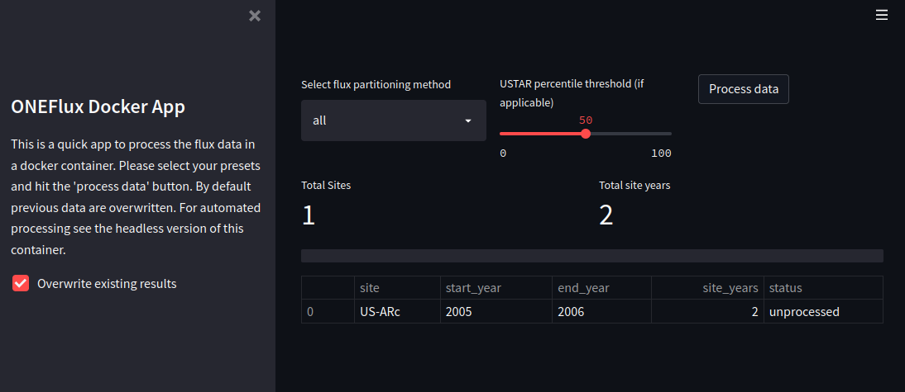

# ONEFlux docker images

Automating deployment of the [ONEFlux processing pipeline](https://github.com/fluxnet/ONEFlux) by BlueGreen Labs.

## Interactive image

The interactive image is compiled without calling any additional scripts. It's
sole purpose is to provide a consistent and functional environment in which
the ONEFlux processing chain will run without having to deal with annoying
python install. You can get access to the session by starting an interactive
docker session.

```bash
# build the image (in the interactive folder)
docker build -t oneflux-interactive .

# drop into a command prompt with a functional
# ONEFlux install
docker run -ti oneflux-interactive:latest
```

## Headless image

Using the headless image you can use oneflux using a rather long but easily
understood command:

```bash
# build the image (in the headless folder)
docker build -t oneflux-headless .

# process the demo data
docker run -v /your/data/:/data oneflux-headless:latest all "/data" US-ARc "US-ARc_sample_input" 2005 2006 -l fluxnet_pipeline_US-ARc.log --mcr /opt/mcr/v94/ --recint hh
```

Here, `docker run -v /your/data/:/data test:latest` starts a docker
image instance where you mount (connect) your data location `/your/data/` to
the virtual file system `/data/` location. In the headless instance the
`onefluxprocessing.py` python script is started by default and awaits its
usual input parameters. Consequently, the remaining command as specified
are the input parameters to the standard python script. The only difference is
that you shouldn't specify your local file storage location but the virtual
docker image location `/data/`.

## ONEFlux docker App

To track progress more easily a streamlit GUI based wrapper is provided to 
the processing. Sadly, I have given up on developing this further than the state
it is currently in (non-functional) due to the neglect of the underlying
codebase which relies on old python 2.7 code. The latter does not allow for
easy processing of data. It is stated that supposedly python 3.5+ should be
functional, but in reality it isn't. Below are the instructions to build the
current image and a preview of the simple layout in Streamlit. BlueGreen Labs
proud itself in providing accessible software solutions to science problems
but does not clean up bad data governance policies. Any commits to resolve this
issue by getting a functional image on python 3.5+ are welcome.

```bash
# build the image (in the headless folder)
docker build -t oneflux-app .

# start the service
docker run -p 8501:8501 -v /your/data/:/data oneflux-app:latest
```



